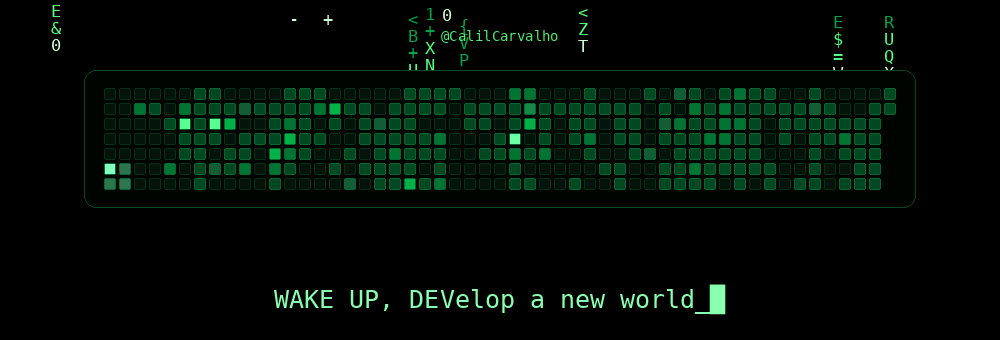

## Snippet para um README de perfil já existente

Cole somente este bloco onde quiser que a animação apareça:

```html
<p align="center">
  
</p>
```

O workflow usa automaticamente o dono do repositório (`github.repository_owner`), então não é necessário colocar seu username no código.
